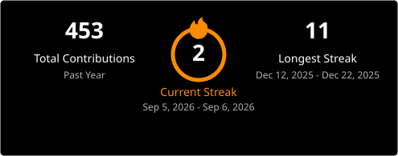
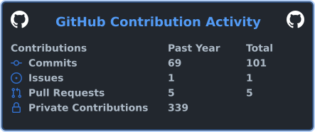

# Satyam Kumar Singh

### Full-Stack Engineer · AI Engineer · Founder

Building production-grade products across **AI, Full-Stack, Realtime Systems & Web3.**

 

  

---

## About

I'm **Satyam Kumar Singh**, a Full-Stack & AI Engineer focused on building and shipping real products.

- Founder — **Bitbulb Studios**
- Technical Lead — **DonArt Studio**
- Co-Lead — **GDGC on Campus, NMIET**
- **25+ Hackathons**
- **5+ Wins**
- **10+ Finalist Finishes**
- National-Level Winner — **Techathon 2.0**

> Building systems. Shipping products. Solving real problems.

---

## Tech Stack

### Languages

### Frontend

### Backend & Database

### AI & Web3

### Tools & Platforms

---

# GitHub Analytics

  

> Analytics are generated automatically by GitHub Actions and stored in this repository.

---

# Contribution Activity

---

# Featured Projects

<table>
<tr>
<td width="50%" valign="top">

### StudySync

A collaborative study-focused platform built to improve learning workflows and productivity.

**Repository:**  
[View StudySync →](https://github.com/SATYAM-KS/StudySync)

</td>
<td width="50%" valign="top">

### Carex.Ai

An AI-focused project exploring intelligent assistance and healthcare-oriented workflows.

**Repository:**  
[View Carex.Ai →](https://github.com/SATYAM-KS/Carex.Ai)

</td>
</tr>

<tr>
<td width="50%" valign="top">

### EvolveX

Hackathon project behind the **Falcon Disaster Response System**, built around technology-assisted disaster response.

**Repository:**  
[View EvolveX →](https://github.com/SATYAM-KS/EvolveX-falcon)

</td>
<td width="50%" valign="top">

### Heartbeat

A full-stack project focused on building and shipping a complete web product.

**Repository:**  
[View Heartbeat →](https://github.com/SATYAM-KS/heartbeat-project)

</td>
</tr>
</table>

---

# Experience

<table>
<tr>
<td width="50%" valign="top">

### Bitbulb Studios

**Founder**

Building and delivering production websites and software for clients.

</td>

<td width="50%" valign="top">

### DonArt Studio

**Technical Lead**

Leading architecture and development across concurrent product workstreams.

</td>
</tr>
</table>

---

# Hackathons

### 25+ Hackathons

**5+ Wins · 10+ Finalist Finishes**

### National-Level Winner — Techathon 2.0

**Falcon Disaster Response System**

---

# Currently Building

`AI Agents` · `LLM Applications` · `RAG` · `Realtime Systems`

`Full-Stack SaaS` · `Web3` · `Developer Tools`

---

## Let's Build Something.

  

**Building. Shipping. Iterating.**

